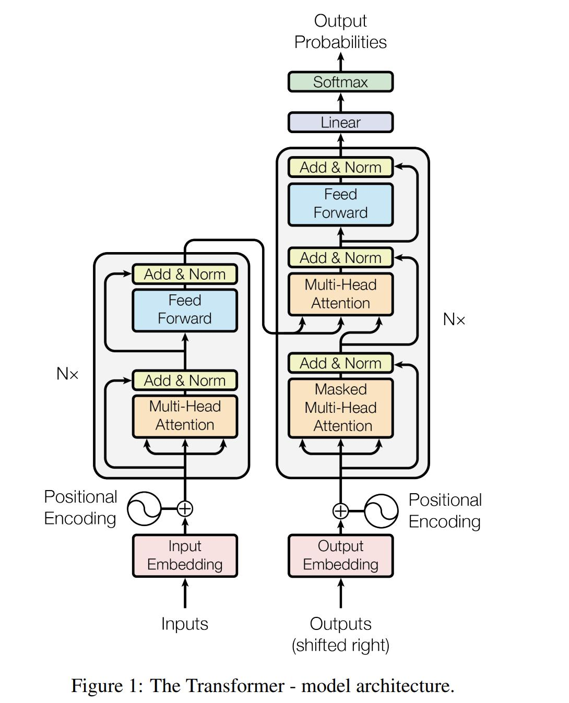

seq2seq模型（encoder+attention+decoder）
- CNN 
  - 平移不变性，可并行计算
  - 滑动窗口，具有局部关联性建模，依靠多层堆积来进行长程建模。
  - 对相对位置敏感，对绝对位置不敏感。
- RNN 
  - 依次有序递归建模，对顺序敏感，对相对位置敏感，对绝对位置敏感。
  - 串行计算耗时，计算复杂度与序列长度成线性关系，单步计算复杂度不变。
  - 长程建模能力弱。
- Transformer
  - 无局部假设。可并行计算，对相对位置不敏感。
  - 无有序假设。需要位置编码来反映位置变化对于特征的影响。对绝对位置不敏感。
  - 任意两字符都可以建模。擅长长短程建模。自注意力机制需要序列程度的平方级别复杂度。

Transformer

- encoder
  - input word embedding：one-hot进入一个无bias的ffn(feed-forward network)得到一个稠密的连续向量
  - position encoding：
    - 通过sin/cos来固定表征，此时每个位置都是确定的；可推广到更长的句子；pe(pos+k)可由pe(pos)表示
    - 通过残差连接来使得位置信息进入深层
  - multi-head self-attention
    - 由多组Q,K,V组成，每组单独计算一个attenion向量，并进入一个不带bias的ffn得到最终向量
    - 使得建模能力更强，表征更丰富
  - feed-forward network
    - 只考虑每个单独位置进行建模。不同位置参数共享。类似于1*1 point wise convolution
- decoder
  - output word embedding
  - masked multi-head self-attention
  - multi-head cross-attention
  - feed-forward network
  - sotfmax

